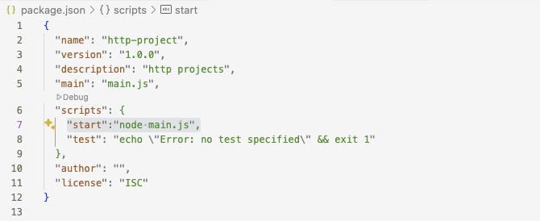

1. clone repository:
git clone https://github.com/hjkr/http-project.git
2. install nvm
curl -o- https://raw.githubusercontent.com/nvm-sh/nvm/v0.39.1/install.sh | bash
3. install node:
nvm install
4. excute `nvm use`
5. execute `npm init`
6. add "start":"node main.js" into package.json

